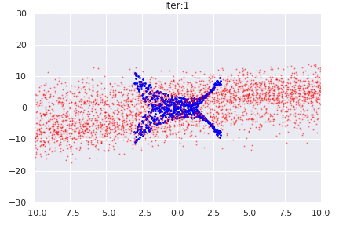
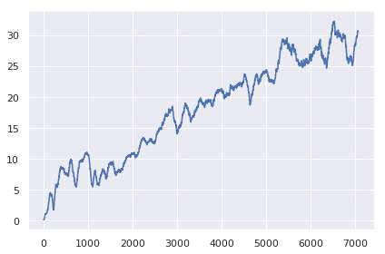

# Deep Reinforcement Learning with PyTorch

- [x] 1. Dynamic Programming (Update : 13. 2. 2019)

     1. Conditional GAN

     

     2. Policy Iteration & Value Iteration
- [x] 2. Value Based Methods (Update : 17. 2. 2019)

     1. [Vanilla DQN](https://www.nature.com/articles/nature14236)

     2. [PDD DQN](https://blog.openai.com/openai-baselines-dqn/)

     
- [x] 3. Policy Based Methods (Update : 23. 2. 2019)

     1. [A2C](https://blog.openai.com/baselines-acktr-a2c/)

     2. [PPO](https://blog.openai.com/openai-baselines-ppo/)

     

- [x] 4. Off-policy Policy Based Methods (Update : 10. 3. 2019)

     1. [SAC](https://ai.googleblog.com/2019/01/soft-actor-critic-deep-reinforcement.html)

     2. [SIL](https://arxiv.org/abs/1806.05635) ( not with A2C, PPO but SAC)

     

- [x] 5. Exploration Techniques (Update : 16. 3. 2019)

     1. [Thompson sampling with MCDO](http://mlg.eng.cam.ac.uk/yarin/blog_3d801aa532c1ce.html)
     2. [RND](https://openai.com/blog/reinforcement-learning-with-prediction-based-rewards/)

    Breakout with only intrinsic rewards

    

- [x] 6. Uncertainty in RL (Update : 24. 3. 2019)

     1. [Categorical DQN(C51)](https://flyyufelix.github.io/2017/10/24/distributional-bellman.html)
     2. [QR-DQN](https://arxiv.org/pdf/1710.10044)
     3. [Implicit Quantile Networks](https://arxiv.org/pdf/1806.06923)

     

- [x] 7. Imitation Learning (Update : 30. 3. 2019)
     1. [GAIL](https://arxiv.org/abs/1606.03476)

- [x] 8. Multi-Agent RL (Update : 4. 4. 2019)
     1. [Upper Confidence Bounds for Tree(UCT)](http://mcts.ai/pubs/mcts-survey-master.pdf)